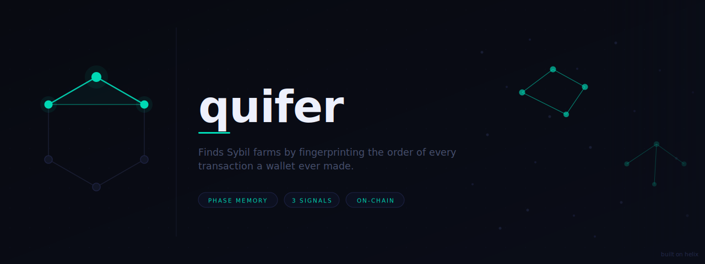
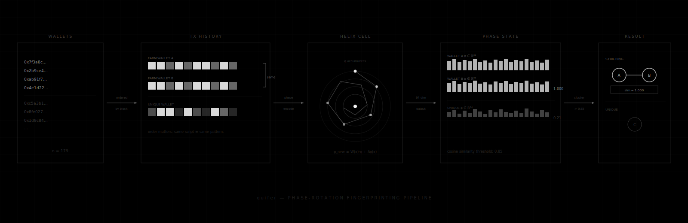

Finds Sybil farms by fingerprinting the order of every transaction a wallet ever made.

Each wallet's full transaction history gets compressed into a 64-dimensional phase state using Helix, a phase-rotation sequence memory. Wallets that ran the same script in the same order end up with the same fingerprint. Cluster by cosine similarity to find the rings.

## How it works



Transaction order matters. Two wallets with identical transactions in different order get different fingerprints. Standard feature vectors lose this. Phase accumulation does not.

Each transaction encodes 12 features: value, gas used, gas price, hour of day, day of week, nonce, contract call flag, error flag, block position, value bucket. These feed into a Helix phase cell one at a time. The final accumulated phase state is the fingerprint.

## Real results - three protocols

| Protocol | Year | Chain | Wallets analyzed | Clusters | Flagged |
|---|---|---|---|---|---|
| Arbitrum ARB | 2023 | Arbitrum One | 179 | 10 | 70 (39%) |
| Uniswap UNI | 2020 | Ethereum | 199 | 0 | 0 |
| Hop HOP | 2022 | Ethereum | 191 | 0 | 0 |

The null results are not failures. Uniswap UNI (2020) predates organized airdrop farming - wallets had rich, diverse histories that don't cluster. Hop explicitly excluded Sybils before distributing, so the claimers we analyzed are the ones that passed their filter. quifer finding nothing on a clean population is correct behavior.

The Arbitrum airdrop is where farms slipped through. quifer caught them.

### Arbitrum - Cluster 01 (13 wallets, similarity 0.879)

All 13 wallets had exactly 59 transactions. 12 of 13 called the SushiSwap V2 router (`0x1b02da8c...`) exactly 21 times each. Same contract, same call count, across 13 different wallets. Not coincidence - a script.

### Arbitrum - Cluster 02 (11 wallets, similarity 1.000)

Every wallet had exactly 10 transactions in the same order:

1. `claim()` on the airdrop distributor
2. `transfer()` ARB out
3. Send ETH back to `0x2ad57019...` (x3 times)
4. `claim()` again
5. `exactInputSingle()` on Uniswap V3
6. `transfer()` ARB out again
7. Send remaining ETH back to `0x2ad57019...`

`0x2ad57019979999f9cef1cc72421ff28e796d8e90` is the operator's funding wallet - it sent ETH to all 11 farm wallets before the campaign and received it back after. quifer found not just the farm wallets but the operator behind them.

## Limitations

- Only uses Etherscan normal transaction history. ERC-20 token transfers and internal transactions not included yet.
- Wallets with fewer than 10 transactions are skipped. Low tx count = low entropy = unreliable fingerprint.
- No cross-chain support. A farm split across Ethereum, Arbitrum, and Optimism looks like three separate farms.
- Script-level farms are caught reliably. Manual farms (phone farms, human operators) produce noisier fingerprints - you would need to lower the threshold and accept more false positives.
- The similarity threshold (default 0.85) is conservative. Lower to 0.75 to catch looser clusters, but expect noise.

## Usage

```bash
pip install -r requirements.txt

# Demo mode, no API key needed
python run.py --mode demo

# Analyze all claimers from an airdrop contract
python run.py --mode airdrop --contract 0xYourContractAddress --limit 500

# Analyze a list of addresses from a file
python run.py --mode file --input addresses.txt

# Adjust clustering sensitivity (default 0.85)
python run.py --mode airdrop --contract 0x... --threshold 0.80
```

## Setup

Copy `.env.example` to `.env` and add your Etherscan API key.

```bash
cp .env.example .env
# then edit .env and fill in ETHERSCAN_API_KEY
```

Get a free key at etherscan.io/myapikey. Free tier is enough for testing (5 req/s, 100k req/day).

## Output

Results are saved to `results/` as both CSV and JSON.

CSV columns: `cluster_id, cluster_size, mean_similarity, min_similarity, seed, address`

## Built on

[Helix](https://github.com/phimemory/helix) - phase-rotation sequence memory architecture.
