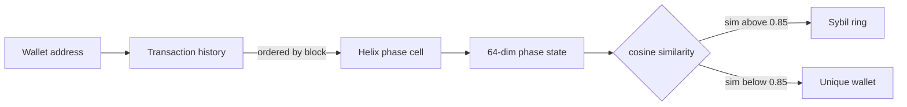

# quifer

Sybil detection via behavioral phase fingerprints.

Each wallet's full transaction history gets compressed into a 64-dimensional phase state using Helix, a phase-rotation sequence memory. Wallets that made similar transactions in similar order end up with similar phase states. Cluster by cosine similarity to find Sybil rings automatically.

## How it works



Transaction order matters. Two wallets with 1,200 identical transactions in different order get different fingerprints. Phase accumulation is order-sensitive. Standard feature vectors lose this.

Each transaction encodes 12 features: value, gas used, gas price, hour of day, day of week, nonce, contract call flag, error flag, block position, value bucket. These feed into a Helix phase cell one at a time. The final accumulated phase state is the fingerprint.

## Results

Smoke test (simulated phase states, no real transactions):

- Wallet pair with the same behavior sequence: similarity = 0.998
- Same wallet vs unrelated wallet: similarity = 0.09
- Threshold for Sybil ring membership: 0.85

Real-world validation pending. Planned: run on Eigenlayer and Arbitrum airdrop claimer sets where community Sybil reports already exist, to get a labeled benchmark.

## Limitations

- Only uses Etherscan normal transaction history. ERC-20 token transfers and internal transactions are not included yet.
- Fingerprint quality depends on transaction count. Wallets with fewer than 20 transactions produce unreliable fingerprints.
- No cross-chain support yet. A wallet that split activity across Ethereum, Arbitrum, and Optimism looks like three different wallets.
- The similarity threshold (default 0.85) is conservative. You will miss loose clusters. Lower it to 0.75 to catch more, but expect more noise.

## Usage

```bash
pip install -r requirements.txt

# Demo mode, no API key needed
python run.py --mode demo

# Analyze all claimers from an airdrop contract
python run.py --mode airdrop --contract 0xYourContractAddress --limit 500

# Analyze a list of addresses from a file
python run.py --mode file --input addresses.txt

# Adjust clustering sensitivity (default 0.85)
python run.py --mode airdrop --contract 0x... --threshold 0.80
```

## Setup

Copy `.env.example` to `.env` and add your Etherscan API key.

```bash
cp .env.example .env
# then edit .env and fill in ETHERSCAN_API_KEY
```

Get a free key at etherscan.io/myapikey. Free tier is enough for testing (5 req/s, 100k req/day).

## Output

Results are saved to `results/` as both CSV and JSON.

CSV columns: `cluster_id, cluster_size, mean_similarity, min_similarity, seed, address`

## Built on

[Helix](https://github.com/Cintu07/helix) - phase-rotation sequence memory architecture.
